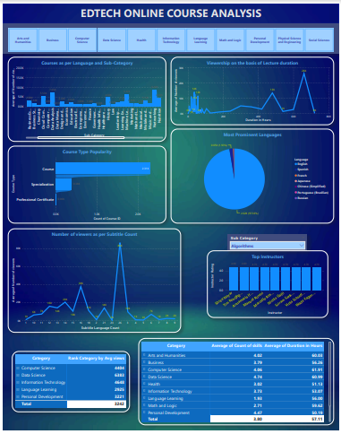

# EdTech Insights Dashboard

## Project Overview

This project aims to uncover valuable insights for an EdTech startup that wants to grow its offerings in recorded lectures. By analyzing data from various EdTech websites, the goal is to provide the startup with data-driven insights to help them make informed decisions about course offerings, viewer engagement, content accessibility, and instructor performance.

The dashboard provides visualizations that explore various aspects such as:

- **Course distribution by category and sub-category**
- **Viewer engagement by category, sub-category, and language**
- **Language preferences for each category**
- **Impact of subtitles on viewer engagement**
- **Top instructors by category and sub-category**
- **Course duration and viewership insights**

The insights help the startup make strategic decisions about which course types to launch, which languages to focus on, and which instructors to engage with for the highest impact.

---

## Dataset

The dataset used for analysis is the [**Online Courses Dataset**](https://www.kaggle.com/datasets/khaledatef1/online-courses) from Kaggle. It contains information about various online courses, including course types, instructors, ratings, views, and more.

---

## Problem Statement

You are a data analyst working with an EdTech startup that wants to grow its offerings in recorded lectures. The company has collected data from various EdTech websites but needs your expertise to make sense of it. Your task is to clean and analyze this data to uncover valuable insights.

### Key Insights to be Uncovered:
1. **Course Distribution**: Examine the distribution of course types across categories.
2. **Viewer Engagement**: Calculate the average number of views for each category, sub-category, and language.
3. **Language Preferences**: Investigate the distribution of various languages in which courses are created.
4. **Subtitles Impact**: Determine the relationship between subtitles and viewer engagement.
5. **Instructor Performance**: Identify the top instructors based on ratings.
6. **Course Duration**: Analyze the relationship between course duration and number of views.
7. **Skills Impact**: Investigate the impact of skills variety on viewership.

---

## Power BI Dashboard

This repository includes the **Power BI Dashboard** that visualizes the insights mentioned above. The dashboard allows stakeholders to explore the data interactively and gain insights into key areas of focus for their business strategy.



---

## Files Included

- **EdTech_Startup.pbix**: Power BI file containing the interactive dashboard.
- **Project Problem Statement.docx**: The detailed project problem statement document.
- **dashboard.png**: A snapshot of the Power BI dashboard visual.

---

## Setup Instructions

1. Clone this repository to your local machine:
   ```bash
   git clone https://github.com/farshadabdulazeez/EdTech_Insights_Dashboard.git
